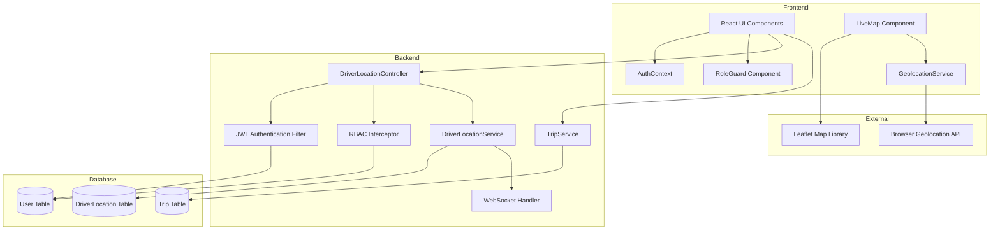
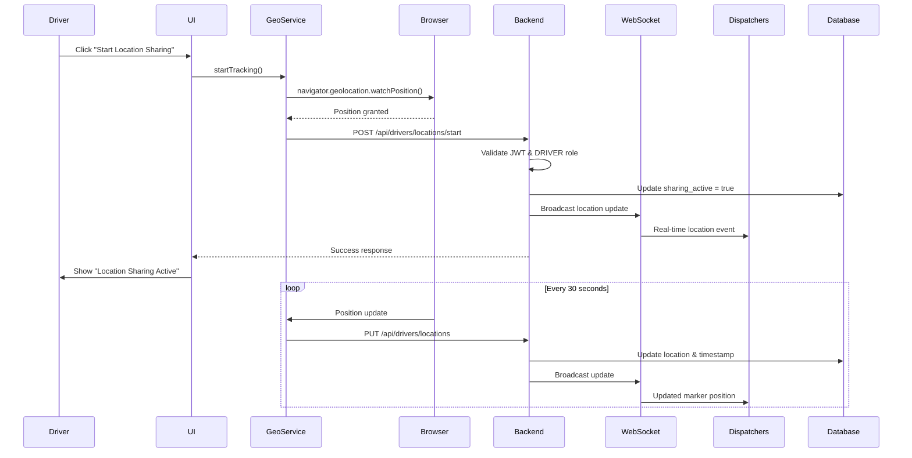
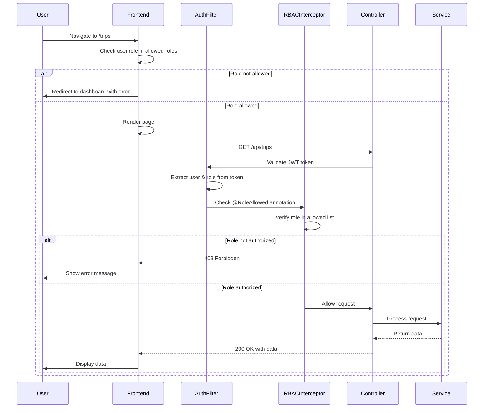

# Design Document: Driver Location & RBAC

## Overview

This design implements real-time driver location tracking with manual control and comprehensive role-based access control (RBAC) for the FleetFlow fleet management system. The solution enables drivers to share their location via the browser Geolocation API, provides visual distinction for the logged-in driver on the map, and restricts feature access based on five user roles (MANAGER, DISPATCHER, SAFETY_OFFICER, ANALYST, DRIVER).

### Key Design Decisions

1. **Browser-Based Geolocation**: Use the W3C Geolocation API for driver location capture rather than mobile apps, enabling web-based tracking without additional infrastructure.

2. **Manual Control Model**: Drivers explicitly start/stop location sharing rather than automatic tracking, providing privacy control and reducing battery/data consumption when not needed.

3. **Dual-Layer RBAC**: Implement role checks at both frontend (navigation/UI) and backend (API endpoints) to ensure security even if frontend is bypassed.

4. **WebSocket Broadcasting**: Leverage existing WebSocket infrastructure for real-time location updates to all connected clients viewing the LiveMap.

5. **Accuracy-Based Warnings**: Display visual indicators when location accuracy exceeds 100 meters, helping dispatchers assess data reliability.

### Architecture Principles

- **Separation of Concerns**: Location service, RBAC module, and UI components remain independent
- **Progressive Enhancement**: Core features work without location sharing; location adds value when enabled
- **Privacy by Design**: Location tracking requires explicit opt-in and can be stopped at any time
- **Fail-Safe Defaults**: Deny access by default; grant only when role explicitly permits

## Architecture

### System Components



### Data Flow

#### Location Sharing Activation Flow



#### RBAC Authorization Flow



## Components and Interfaces

### Frontend Components

#### 1. GeolocationService

**Purpose**: Encapsulate browser Geolocation API interactions and manage location tracking lifecycle.

**Interface**:
```javascript
class GeolocationService {
  // Start continuous location tracking
  startTracking(onSuccess, onError, options)
  
  // Stop location tracking
  stopTracking()
  
  // Get current position once
  getCurrentPosition(onSuccess, onError, options)
  
  // Check if geolocation is supported
  isSupported()
  
  // Check permission status
  async checkPermission()
}
```

**Configuration**:
```javascript
const HIGH_ACCURACY_OPTIONS = {
  enableHighAccuracy: true,
  timeout: 10000,
  maximumAge: 0
};

const TRACKING_INTERVAL = 30000; // 30 seconds
```

**Error Handling**:
- `PERMISSION_DENIED`: Show modal with instructions
- `POSITION_UNAVAILABLE`: Retry with exponential backoff
- `TIMEOUT`: Increase timeout and retry
- Consecutive failures (5+): Auto-stop tracking and notify user

#### 2. RoleGuard Component

**Purpose**: Protect routes and conditionally render UI elements based on user role.

**Interface**:
```javascript
// Route protection
<RoleGuard allowedRoles={['MANAGER', 'DISPATCHER']}>
  <TripsPage />
</RoleGuard>

// Conditional rendering
<RoleGuard allowedRoles={['MANAGER']} fallback={<ReadOnlyView />}>
  <EditableView />
</RoleGuard>

// Hook for role checks
const { hasRole, hasAnyRole, hasAllRoles } = useRoleGuard();
```

**Implementation**:
```javascript
function RoleGuard({ allowedRoles, children, fallback = null, redirect = '/dashboard' }) {
  const { user } = useAuth();
  const navigate = useNavigate();
  
  if (!user) {
    return <Navigate to="/login" />;
  }
  
  if (!allowedRoles.includes(user.role)) {
    if (redirect) {
      toast.error('You do not have permission to access this feature');
      return <Navigate to={redirect} />;
    }
    return fallback;
  }
  
  return children;
}
```

#### 3. DriverDashboard Component

**Purpose**: Display driver-specific dashboard with location controls and trip summary.

**Features**:
- Location sharing status indicator
- Start/Stop/Update location buttons
- Current coordinates and last update timestamp
- Today's assigned trips summary
- Quick link to view location on map
- Statistics: total trips completed, total distance

**State Management**:
```javascript
const [locationSharing, setLocationSharing] = useState(false);
const [currentLocation, setCurrentLocation] = useState(null);
const [lastUpdate, setLastUpdate] = useState(null);
const [todayTrips, setTodayTrips] = useState([]);
const [stats, setStats] = useState({ totalTrips: 0, totalDistance: 0 });
```

#### 4. Enhanced LiveMap Component

**Modifications to Existing Component**:

1. **Me Marker Styling**:
```javascript
const ME_MARKER_ICON = makeIcon('#e74c3c', driverSVG, 38); // Larger, red color

function getIcon(marker, currentUserId) {
  if (marker.markerType === 'DRIVER' && marker.driverId === currentUserId) {
    return ME_MARKER_ICON;
  }
  // ... existing logic
}
```

2. **Auto-Centering Logic**:
```javascript
function AutoCenterOnDriver({ driverId, markers }) {
  const map = useMap();
  const [hasManuallyPanned, setHasManuallyPanned] = useState(false);
  
  useEffect(() => {
    if (hasManuallyPanned) return;
    
    const driverMarker = markers.find(m => 
      m.markerType === 'DRIVER' && m.driverId === driverId
    );
    
    if (driverMarker) {
      map.setView([driverMarker.latitude, driverMarker.longitude], 14);
    }
  }, [markers, driverId, hasManuallyPanned]);
  
  useEffect(() => {
    const handleDragStart = () => setHasManuallyPanned(true);
    map.on('dragstart', handleDragStart);
    return () => map.off('dragstart', handleDragStart);
  }, [map]);
  
  return null;
}
```

3. **Accuracy Warning Display**:
```javascript
// In marker popup
{marker.accuracy && marker.accuracy > 100 && (
  <div style={{ 
    background: '#fff3cd', 
    padding: '4px 8px', 
    borderRadius: 4,
    fontSize: '0.7rem',
    color: '#856404',
    marginTop: 4
  }}>
    ⚠️ Low accuracy: ±{marker.accuracy.toFixed(0)}m
  </div>
)}
```

#### 5. Navigation Component Enhancement

**Role-Based Menu Rendering**:

```javascript
const ROLE_NAVIGATION = {
  DRIVER: [
    { path: '/dashboard', icon: LayoutDashboard, label: 'Dashboard' },
    { path: '/live-map', icon: MapPin, label: 'Live Map' },
    { path: '/my-trips', icon: Navigation, label: 'My Trips' }
  ],
  ANALYST: [
    { path: '/dashboard', icon: LayoutDashboard, label: 'Dashboard' },
    { path: '/live-map', icon: MapPin, label: 'Live Map' },
    { path: '/reports', icon: BarChart3, label: 'Reports' }
  ],
  SAFETY_OFFICER: [
    { path: '/dashboard', icon: LayoutDashboard, label: 'Dashboard' },
    { path: '/drivers', icon: Users, label: 'Drivers' },
    { path: '/trips', icon: Navigation, label: 'Trips' },
    { path: '/live-map', icon: MapPin, label: 'Live Map' },
    { path: '/reports', icon: BarChart3, label: 'Reports' }
  ],
  MANAGER: 'ALL',
  DISPATCHER: 'ALL'
};

function Navigation() {
  const { user } = useAuth();
  const menuItems = ROLE_NAVIGATION[user.role] === 'ALL' 
    ? ALL_MENU_ITEMS 
    : ROLE_NAVIGATION[user.role];
  
  return (
    <nav>
      {menuItems.map(item => (
        <NavLink key={item.path} to={item.path}>
          <item.icon size={18} />
          {item.label}
        </NavLink>
      ))}
    </nav>
  );
}
```

### Backend Components

#### 1. DriverLocationController

**Endpoints**:

```java
@RestController
@RequestMapping("/api/drivers/locations")
@RequiredArgsConstructor
public class DriverLocationController {
    
    private final DriverLocationService locationService;
    
    // Start location sharing (DRIVER only)
    @PostMapping("/start")
    @RoleAllowed("DRIVER")
    public ResponseEntity<ApiResponse<DriverLocationResponse>> startSharing(
        @RequestBody LocationUpdateRequest request,
        @AuthenticationPrincipal UserDetails userDetails
    ) {
        // Implementation
    }
    
    // Stop location sharing (DRIVER only)
    @PostMapping("/stop")
    @RoleAllowed("DRIVER")
    public ResponseEntity<ApiResponse<Void>> stopSharing(
        @AuthenticationPrincipal UserDetails userDetails
    ) {
        // Implementation
    }
    
    // Update location (DRIVER only)
    @PutMapping
    @RoleAllowed("DRIVER")
    public ResponseEntity<ApiResponse<DriverLocationResponse>> updateLocation(
        @RequestBody LocationUpdateRequest request,
        @AuthenticationPrincipal UserDetails userDetails
    ) {
        // Implementation
    }
    
    // Get all driver locations (MANAGER, DISPATCHER, SAFETY_OFFICER, ANALYST)
    @GetMapping
    @RoleAllowed({"MANAGER", "DISPATCHER", "SAFETY_OFFICER", "ANALYST"})
    public ResponseEntity<ApiResponse<List<DriverLocationResponse>>> getAllLocations() {
        // Implementation
    }
    
    // Get specific driver location (MANAGER, DISPATCHER, SAFETY_OFFICER, ANALYST, or self)
    @GetMapping("/{driverId}")
    public ResponseEntity<ApiResponse<DriverLocationResponse>> getDriverLocation(
        @PathVariable Long driverId,
        @AuthenticationPrincipal UserDetails userDetails
    ) {
        // Check if user is authorized or requesting own location
        // Implementation
    }
    
    // Get location history (MANAGER, DISPATCHER, SAFETY_OFFICER, ANALYST, or self)
    @GetMapping("/{driverId}/history")
    public ResponseEntity<ApiResponse<List<LocationHistoryResponse>>> getLocationHistory(
        @PathVariable Long driverId,
        @RequestParam @DateTimeFormat(iso = DateTimeFormat.ISO.DATE) LocalDate startDate,
        @RequestParam @DateTimeFormat(iso = DateTimeFormat.ISO.DATE) LocalDate endDate,
        @AuthenticationPrincipal UserDetails userDetails
    ) {
        // Implementation
    }
}
```

#### 2. DriverLocationService

**Methods**:

```java
@Service
@RequiredArgsConstructor
@Slf4j
public class DriverLocationService {
    
    private final DriverLocationRepository locationRepo;
    private final DriverRepository driverRepo;
    private final LocationHistoryRepository historyRepo;
    private final WebSocketHandler wsHandler;
    
    private static final int MAX_HISTORY_DAYS = 30;
    private static final int RETENTION_DAYS = 90;
    
    public DriverLocationResponse startLocationSharing(Long driverId, LocationUpdateRequest request) {
        // Validate driver exists
        // Create or update DriverLocation with sharing_active = true
        // Save location to history
        // Broadcast via WebSocket
        // Return response
    }
    
    public void stopLocationSharing(Long driverId) {
        // Update sharing_active = false
        // Broadcast status change via WebSocket
    }
    
    public DriverLocationResponse updateLocation(Long driverId, LocationUpdateRequest request) {
        // Validate sharing is active
        // Update location, timestamp, accuracy
        // Save to history
        // Broadcast via WebSocket
        // Return response
    }
    
    public List<DriverLocationResponse> getAllActiveLocations() {
        // Return all drivers with sharing_active = true
    }
    
    public DriverLocationResponse getDriverLocation(Long driverId) {
        // Return current location for driver
    }
    
    public List<LocationHistoryResponse> getLocationHistory(
        Long driverId, 
        LocalDate startDate, 
        LocalDate endDate
    ) {
        // Validate date range <= MAX_HISTORY_DAYS
        // Query location_history table
        // Return chronological list
    }
    
    @Scheduled(cron = "0 0 2 * * *") // 2 AM daily
    public void purgeOldLocationHistory() {
        // Delete records older than RETENTION_DAYS
        log.info("Purged location history older than {} days", RETENTION_DAYS);
    }
}
```

#### 3. RBAC Interceptor

**Implementation**:

```java
@Component
@RequiredArgsConstructor
@Slf4j
public class RoleBasedAccessInterceptor implements HandlerInterceptor {
    
    private final AuditLogService auditLogService;
    
    @Override
    public boolean preHandle(
        HttpServletRequest request, 
        HttpServletResponse response, 
        Object handler
    ) throws Exception {
        
        if (!(handler instanceof HandlerMethod)) {
            return true;
        }
        
        HandlerMethod handlerMethod = (HandlerMethod) handler;
        RoleAllowed roleAllowed = handlerMethod.getMethodAnnotation(RoleAllowed.class);
        
        if (roleAllowed == null) {
            return true; // No role restriction
        }
        
        Authentication auth = SecurityContextHolder.getContext().getAuthentication();
        
        if (auth == null || !auth.isAuthenticated()) {
            response.sendError(HttpServletResponse.SC_UNAUTHORIZED, "Not authenticated");
            return false;
        }
        
        String userRole = auth.getAuthorities().stream()
            .findFirst()
            .map(GrantedAuthority::getAuthority)
            .orElse("");
        
        String[] allowedRoles = roleAllowed.value();
        boolean hasAccess = Arrays.asList(allowedRoles).contains(userRole);
        
        if (!hasAccess) {
            // Log unauthorized access attempt
            auditLogService.logUnauthorizedAccess(
                auth.getName(),
                userRole,
                request.getRequestURI(),
                request.getMethod()
            );
            
            log.warn("Unauthorized access attempt: user={}, role={}, endpoint={}", 
                auth.getName(), userRole, request.getRequestURI());
            
            response.sendError(HttpServletResponse.SC_FORBIDDEN, 
                "Access denied: insufficient permissions");
            return false;
        }
        
        return true;
    }
}
```

**Custom Annotation**:

```java
@Target(ElementType.METHOD)
@Retention(RetentionPolicy.RUNTIME)
public @interface RoleAllowed {
    String[] value();
}
```

#### 4. TripController Enhancement

**Driver Filtering**:

```java
@GetMapping
public ResponseEntity<ApiResponse<List<TripResponse>>> getTrips(
    @AuthenticationPrincipal UserDetails userDetails
) {
    User user = (User) userDetails;
    List<TripResponse> trips;
    
    if (user.getRole() == Role.DRIVER) {
        // Filter to only trips assigned to this driver
        trips = tripService.getTripsByDriverId(user.getId());
    } else if (user.getRole() == Role.ANALYST) {
        // Return all trips but mark as read-only
        trips = tripService.getAllTrips();
        // Frontend will hide edit/delete buttons
    } else {
        // MANAGER, DISPATCHER, SAFETY_OFFICER see all trips
        trips = tripService.getAllTrips();
    }
    
    return ResponseEntity.ok(ApiResponse.success(trips));
}

@PutMapping("/{id}")
@RoleAllowed({"MANAGER", "DISPATCHER"})
public ResponseEntity<ApiResponse<TripResponse>> updateTrip(
    @PathVariable Long id,
    @RequestBody TripUpdateRequest request
) {
    // Only MANAGER and DISPATCHER can update trips
    // Implementation
}
```

#### 5. WebSocket Handler Enhancement

**Location Update Broadcasting**:

```java
@Component
@RequiredArgsConstructor
@Slf4j
public class LocationWebSocketHandler {
    
    private final SimpMessagingTemplate messagingTemplate;
    
    public void broadcastLocationUpdate(DriverLocationResponse location) {
        messagingTemplate.convertAndSend(
            "/topic/locations",
            LocationUpdateEvent.builder()
                .type("LOCATION_UPDATE")
                .driverId(location.getDriverId())
                .latitude(location.getLatitude())
                .longitude(location.getLongitude())
                .accuracy(location.getAccuracy())
                .timestamp(location.getLastUpdated())
                .build()
        );
    }
    
    public void broadcastSharingStatusChange(Long driverId, boolean active) {
        messagingTemplate.convertAndSend(
            "/topic/locations",
            SharingStatusEvent.builder()
                .type("SHARING_STATUS_CHANGE")
                .driverId(driverId)
                .active(active)
                .timestamp(LocalDateTime.now())
                .build()
        );
    }
}
```

## Data Models

### Database Schema Changes

#### 1. DriverLocation Table Enhancement

```sql
ALTER TABLE driver_locations 
ADD COLUMN sharing_active BOOLEAN DEFAULT FALSE,
ADD COLUMN accuracy DOUBLE PRECISION,
ADD COLUMN consecutive_failures INTEGER DEFAULT 0,
ADD COLUMN last_error VARCHAR(255);

-- Index for active location queries
CREATE INDEX idx_driver_locations_sharing_active 
ON driver_locations(sharing_active) 
WHERE sharing_active = TRUE;
```

#### 2. LocationHistory Table (New)

```sql
CREATE TABLE location_history (
    id BIGSERIAL PRIMARY KEY,
    driver_id BIGINT NOT NULL REFERENCES drivers(id) ON DELETE CASCADE,
    latitude DOUBLE PRECISION NOT NULL,
    longitude DOUBLE PRECISION NOT NULL,
    accuracy DOUBLE PRECISION,
    speed DOUBLE PRECISION,
    heading DOUBLE PRECISION,
    recorded_at TIMESTAMP NOT NULL DEFAULT CURRENT_TIMESTAMP,
    
    CONSTRAINT chk_latitude CHECK (latitude >= -90 AND latitude <= 90),
    CONSTRAINT chk_longitude CHECK (longitude >= -180 AND longitude <= 180),
    CONSTRAINT chk_accuracy CHECK (accuracy >= 0)
);

-- Index for history queries
CREATE INDEX idx_location_history_driver_time 
ON location_history(driver_id, recorded_at DESC);

-- Index for purge operations
CREATE INDEX idx_location_history_recorded_at 
ON location_history(recorded_at);
```

#### 3. AuditLog Table (New)

```sql
CREATE TABLE audit_logs (
    id BIGSERIAL PRIMARY KEY,
    user_id BIGINT REFERENCES users(id) ON DELETE SET NULL,
    username VARCHAR(255) NOT NULL,
    user_role VARCHAR(50) NOT NULL,
    action_type VARCHAR(50) NOT NULL, -- UNAUTHORIZED_ACCESS, LOGIN, LOGOUT, etc.
    resource_uri VARCHAR(500),
    http_method VARCHAR(10),
    ip_address VARCHAR(45),
    user_agent TEXT,
    created_at TIMESTAMP NOT NULL DEFAULT CURRENT_TIMESTAMP
);

-- Index for audit queries
CREATE INDEX idx_audit_logs_user_time 
ON audit_logs(user_id, created_at DESC);

CREATE INDEX idx_audit_logs_action_time 
ON audit_logs(action_type, created_at DESC);
```

### DTOs

#### LocationUpdateRequest

```java
@Data
@NoArgsConstructor
@AllArgsConstructor
@Builder
public class LocationUpdateRequest {
    
    @NotNull(message = "Latitude is required")
    @Min(value = -90, message = "Latitude must be >= -90")
    @Max(value = 90, message = "Latitude must be <= 90")
    private Double latitude;
    
    @NotNull(message = "Longitude is required")
    @Min(value = -180, message = "Longitude must be >= -180")
    @Max(value = 180, message = "Longitude must be <= 180")
    private Double longitude;
    
    @Min(value = 0, message = "Accuracy must be >= 0")
    private Double accuracy;
    
    @Min(value = 0, message = "Speed must be >= 0")
    private Double speed;
    
    @Min(value = 0, message = "Heading must be >= 0")
    @Max(value = 360, message = "Heading must be <= 360")
    private Double heading;
}
```

#### DriverLocationResponse

```java
@Data
@NoArgsConstructor
@AllArgsConstructor
@Builder
public class DriverLocationResponse {
    private Long driverId;
    private String fullName;
    private Double latitude;
    private Double longitude;
    private Double accuracy;
    private Double speed;
    private Double heading;
    private Boolean sharingActive;
    private LocalDateTime lastUpdated;
}
```

#### LocationHistoryResponse

```java
@Data
@NoArgsConstructor
@AllArgsConstructor
@Builder
public class LocationHistoryResponse {
    private Long id;
    private Long driverId;
    private Double latitude;
    private Double longitude;
    private Double accuracy;
    private Double speed;
    private Double heading;
    private LocalDateTime recordedAt;
}
```

### Entity Updates

#### DriverLocation Entity

```java
@Entity
@Table(name = "driver_locations")
@Data @NoArgsConstructor @AllArgsConstructor @Builder
public class DriverLocation {

    @Id
    private Long driverId;

    @OneToOne(fetch = FetchType.LAZY)
    @MapsId
    @JoinColumn(name = "driver_id")
    private Driver driver;

    @Column(nullable = false)
    private Double latitude;

    @Column(nullable = false)
    private Double longitude;

    @Column
    private Double accuracy;

    @Column(nullable = false)
    private Double speed;

    @Column
    private Double heading;

    @Column(nullable = false)
    private Boolean sharingActive = false;

    @Column
    private Integer consecutiveFailures = 0;

    @Column
    private String lastError;

    @Column(nullable = false)
    private LocalDateTime lastUpdated;
}
```

#### LocationHistory Entity (New)

```java
@Entity
@Table(name = "location_history")
@Data @NoArgsConstructor @AllArgsConstructor @Builder
public class LocationHistory {

    @Id
    @GeneratedValue(strategy = GenerationType.IDENTITY)
    private Long id;

    @Column(nullable = false)
    private Long driverId;

    @Column(nullable = false)
    private Double latitude;

    @Column(nullable = false)
    private Double longitude;

    @Column
    private Double accuracy;

    @Column
    private Double speed;

    @Column
    private Double heading;

    @Column(nullable = false)
    private LocalDateTime recordedAt;
}
```


## Correctness Properties

*A property is a characteristic or behavior that should hold true across all valid executions of a system—essentially, a formal statement about what the system should do. Properties serve as the bridge between human-readable specifications and machine-verifiable correctness guarantees.*

### Property Reflection

After analyzing all acceptance criteria, I identified several areas of redundancy:

1. **Location Update Broadcasting**: Criteria 1.4, 3.2 can be combined into one property about broadcasting
2. **Interval Timing**: Criteria 2.3 and 3.1 are identical - combine into one property
3. **Role-Based Navigation**: Criteria 6.1-6.4 can be consolidated into one property with role-specific assertions
4. **RBAC Authorization**: Criteria 7.1, 7.3 overlap - combine into one comprehensive property
5. **RBAC Error Responses**: Criteria 7.2, 7.4 overlap - combine into one property about unauthorized access
6. **Trip Filtering**: Criteria 8.1, 8.2, 8.3 can be combined into one property with role-specific behavior
7. **Dashboard Content**: Criteria 9.2, 9.3, 9.5 can be combined into one property about dashboard data display
8. **Profile Content**: Criteria 11.2, 11.3, 11.4 can be combined into one property about profile data display
9. **Permission State Management**: Criteria 12.3, 12.4 are inverses - combine into one property
10. **ANALYST Read-Only**: Criteria 14.1, 14.2, 14.3, 14.4, 14.5 can be consolidated into fewer comprehensive properties
11. **Accuracy Display**: Criteria 15.1, 15.5 overlap - combine into one property

After consolidation, we have 45 unique properties that provide comprehensive coverage without redundancy.

### Property 1: Location Storage with Timestamp

*For any* valid coordinates returned by the Geolocation API, the system should store them in the database with an associated timestamp and driver ID.

**Validates: Requirements 1.2, 13.2**

### Property 2: Geolocation Error Handling

*For any* error or denial from the Geolocation API, the system should log the error type and display a user-friendly notification to the driver.

**Validates: Requirements 1.3, 15.3**

### Property 3: Location Update Broadcasting

*For any* location update (initialization or subsequent update), the system should broadcast the update via WebSocket to all connected clients viewing the LiveMap.

**Validates: Requirements 1.4, 3.2**

### Property 4: Location Sharing State Persistence

*For any* location sharing state change (start or stop), the system should persist the new state to the database and reflect it in the UI.

**Validates: Requirements 2.5**

### Property 5: Location Update Interval

*For any* active location sharing session, the system should capture and send location updates at 30-second intervals.

**Validates: Requirements 2.3, 3.1**

### Property 6: Location Sharing Stop

*For any* stop location sharing action, the system should immediately cease capturing new location data and update the sharing_active flag to false.

**Validates: Requirements 2.4, 13.4**

### Property 7: Marker Position Update

*For any* location update received via WebSocket, the LiveMap should update the corresponding driver marker position without requiring a page refresh.

**Validates: Requirements 3.3**

### Property 8: Location Update Retry Logic

*For any* failed location update, the system should retry up to 3 times with exponential backoff before reporting failure.

**Validates: Requirements 3.4**

### Property 9: Manual Location Update

*For any* manual "Update My Location" button click, the system should immediately capture the current position and broadcast it, bypassing the 30-second interval.

**Validates: Requirements 3.5**

### Property 10: Me Marker Visual Distinction

*For any* driver viewing the LiveMap, their own marker (Me Marker) should be rendered with a unique color, larger size, distinct icon, and border effect that differs from all other driver markers.

**Validates: Requirements 4.1, 4.2, 4.4**

### Property 11: Me Marker Popup Text

*For any* hover or click on the Me Marker, the popup should display "You are here" text to identify it as the current user's location.

**Validates: Requirements 4.3**

### Property 12: Standard Marker Styling for Non-Drivers

*For any* non-driver user viewing the LiveMap, all driver markers should be rendered with standard styling without any special distinction.

**Validates: Requirements 4.5**

### Property 13: Driver Map Auto-Centering

*For any* driver opening the LiveMap (without prior manual panning), the map viewport should center on the Me Marker coordinates at zoom level 14.

**Validates: Requirements 5.1, 5.2**

### Property 14: Non-Driver Default Centering

*For any* non-driver user opening the LiveMap, the map viewport should center on the default fleet location.

**Validates: Requirements 5.4**

### Property 15: Manual Pan Disables Auto-Center

*For any* driver who manually pans the map, subsequent location updates should not trigger auto-centering, preserving the user's chosen viewport.

**Validates: Requirements 5.5**

### Property 16: Role-Based Navigation Menu

*For any* authenticated user, the navigation menu should display only the links authorized for their role: DRIVER sees Dashboard/LiveMap/My Trips; ANALYST sees Dashboard/LiveMap/Reports; SAFETY_OFFICER sees Dashboard/Drivers/Trips/LiveMap/Reports; MANAGER and DISPATCHER see all links.

**Validates: Requirements 6.1, 6.2, 6.3, 6.4**

### Property 17: Navigation Link Hiding

*For any* feature unauthorized for a user's role, the navigation link should be completely hidden from the menu rather than displayed as disabled.

**Validates: Requirements 6.5**

### Property 18: Route and API Authorization

*For any* protected route or API endpoint access attempt, the system should verify the user's JWT token and role against the required roles before allowing access.

**Validates: Requirements 7.1, 7.3**

### Property 19: Unauthorized Access Response

*For any* route or API access attempt by a user without the required role, the system should deny access by redirecting to the dashboard (frontend) or returning HTTP 403 Forbidden (backend) with an error message.

**Validates: Requirements 7.2, 7.4**

### Property 20: Unauthorized Access Audit Logging

*For any* unauthorized access attempt, the system should create an audit log entry containing the user ID, role, requested resource URI, and timestamp.

**Validates: Requirements 7.5**

### Property 21: Role-Based Trip Filtering

*For any* trips page view, the system should filter results based on role: DRIVER sees only their assigned trips; MANAGER/DISPATCHER/SAFETY_OFFICER see all trips with full access; ANALYST sees all trips in read-only mode.

**Validates: Requirements 8.1, 8.2, 8.3**

### Property 22: Trip Detail Content

*For any* trip detail view by a driver, the system should display the trip route, current status, and assigned vehicle information.

**Validates: Requirements 8.4**

### Property 23: Driver Trip Access Restriction

*For any* driver attempting to view or edit a trip not assigned to them, the system should deny access and return an error.

**Validates: Requirements 8.5**

### Property 24: Driver Dashboard Content

*For any* driver viewing their dashboard, the system should display their current location coordinates, last update timestamp, today's assigned trips summary, and statistics (total trips completed, total distance driven).

**Validates: Requirements 9.2, 9.3, 9.5**

### Property 25: Trip Assignment Notification

*For any* trip assigned to a driver with an active session, the system should send a real-time WebSocket notification and display a toast message with trip details.

**Validates: Requirements 10.1, 10.2**

### Property 26: Notification Navigation

*For any* trip assignment notification clicked by a driver, the system should navigate to the trip details page for that specific trip.

**Validates: Requirements 10.3**

### Property 27: Offline Notification Delivery

*For any* trip assigned to a driver who is not logged in, the system should queue the notification and display it on their next login.

**Validates: Requirements 10.4**

### Property 28: Notification Read Status

*For any* trip detail page viewed by a driver, the system should mark the corresponding trip assignment notification as read.

**Validates: Requirements 10.5**

### Property 29: Driver Profile Content

*For any* driver viewing their profile page, the system should display a list of completed trips with dates and distances, location sharing statistics including total hours tracked, and a timeline of location updates for the current day.

**Validates: Requirements 11.2, 11.3, 11.4**

### Property 30: Location History Time Limit

*For any* location history request, the system should enforce a maximum range of 30 days and reject requests exceeding this limit.

**Validates: Requirements 11.5**

### Property 31: Permission Denial Handling

*For any* geolocation permission denial, the system should display a modal with instructions for enabling location access in browser settings and disable the "Start Location Sharing" button.

**Validates: Requirements 12.1, 12.2, 12.3**

### Property 32: Permission Grant Handling

*For any* geolocation permission grant, the system should enable all location sharing features and update the UI to reflect the available functionality.

**Validates: Requirements 12.4**

### Property 33: Login Permission Check

*For any* driver login, the system should check the geolocation permission status and display appropriate messaging based on the current state.

**Validates: Requirements 12.5**

### Property 34: Location History Retention

*For any* location history record older than 90 days, the automated purge job should delete it from the database.

**Validates: Requirements 13.3**

### Property 35: ANALYST UI Read-Only Mode

*For any* data page viewed by an ANALYST user, the system should hide all edit, delete, and create action buttons, displaying only read and export functionality.

**Validates: Requirements 14.1**

### Property 36: ANALYST API Write Restriction

*For any* API modification request (POST, PUT, DELETE) from an ANALYST user, the system should return HTTP 403 Forbidden status.

**Validates: Requirements 14.2**

### Property 37: ANALYST Map Read-Only

*For any* LiveMap view by an ANALYST user, the system should display all markers and data but disable any control actions that would modify state.

**Validates: Requirements 14.3**

### Property 38: ANALYST Report Permissions

*For any* report viewed by an ANALYST user, the system should allow data export but prevent modification of report configurations.

**Validates: Requirements 14.4**

### Property 39: Dual-Layer Read-Only Enforcement

*For any* ANALYST user action, both frontend and backend layers should independently enforce read-only access restrictions.

**Validates: Requirements 14.5**

### Property 40: Accuracy Recording and Display

*For any* location update captured, the system should record the accuracy value provided by the Geolocation API and display it in meters on the marker popup.

**Validates: Requirements 15.1, 15.5**

### Property 41: Low Accuracy Warning

*For any* location update with accuracy greater than 100 meters, the system should display a low-accuracy warning indicator on the corresponding map marker.

**Validates: Requirements 15.2**

### Property 42: Consecutive Failure Auto-Stop

*For any* location sharing session that experiences 5 consecutive update failures, the system should automatically stop location sharing and notify the driver.

**Validates: Requirements 15.4**

### Property 43: Location Sharing Start Trigger

*For any* "Start Location Sharing" button click, the system should begin continuous location tracking by calling the Geolocation API watchPosition method.

**Validates: Requirements 2.2**

### Property 44: WebSocket Marker Update

*For any* location update broadcast via WebSocket, all connected clients viewing the LiveMap should receive the update and refresh the corresponding marker within 1 second.

**Validates: Requirements 3.3**

### Property 45: High Accuracy Configuration

*For any* location request made by the system, the enableHighAccuracy option should be set to true in the Geolocation API call.

**Validates: Requirements 1.5**

## Error Handling

### Frontend Error Handling

#### Geolocation API Errors

```javascript
const GEOLOCATION_ERRORS = {
  PERMISSION_DENIED: {
    code: 1,
    userMessage: 'Location access denied. Please enable location permissions in your browser settings.',
    action: 'SHOW_PERMISSION_MODAL',
    retry: false
  },
  POSITION_UNAVAILABLE: {
    code: 2,
    userMessage: 'Unable to determine your location. Please check your device settings.',
    action: 'RETRY_WITH_BACKOFF',
    retry: true
  },
  TIMEOUT: {
    code: 3,
    userMessage: 'Location request timed out. Retrying...',
    action: 'RETRY_WITH_INCREASED_TIMEOUT',
    retry: true
  }
};

function handleGeolocationError(error, retryCount = 0) {
  const errorConfig = GEOLOCATION_ERRORS[error.code] || {
    userMessage: 'An unknown error occurred while accessing your location.',
    action: 'LOG_AND_NOTIFY',
    retry: false
  };
  
  // Log error
  console.error('Geolocation error:', error.code, error.message);
  
  // Show user notification
  toast.error(errorConfig.userMessage);
  
  // Take action based on error type
  switch (errorConfig.action) {
    case 'SHOW_PERMISSION_MODAL':
      showPermissionInstructionsModal();
      disableLocationSharing();
      break;
      
    case 'RETRY_WITH_BACKOFF':
      if (retryCount < 3) {
        const delay = Math.pow(2, retryCount) * 1000; // Exponential backoff
        setTimeout(() => requestLocation(retryCount + 1), delay);
      } else {
        stopLocationSharing();
        toast.error('Unable to access location after multiple attempts.');
      }
      break;
      
    case 'RETRY_WITH_INCREASED_TIMEOUT':
      if (retryCount < 3) {
        const newTimeout = 10000 + (retryCount * 5000);
        requestLocation(retryCount + 1, { timeout: newTimeout });
      }
      break;
  }
}
```

#### API Error Handling

```javascript
async function updateLocation(locationData) {
  try {
    const response = await locationAPI.updateLocation(locationData);
    return response.data;
  } catch (error) {
    if (error.response) {
      // Server responded with error status
      switch (error.response.status) {
        case 401:
          toast.error('Session expired. Please log in again.');
          logout();
          break;
        case 403:
          toast.error('You do not have permission to update location.');
          break;
        case 429:
          toast.error('Too many requests. Please wait before updating again.');
          break;
        case 500:
          toast.error('Server error. Location update failed.');
          // Retry logic handled by retry interceptor
          break;
        default:
          toast.error('Failed to update location. Please try again.');
      }
    } else if (error.request) {
      // Request made but no response
      toast.error('Network error. Please check your connection.');
    } else {
      // Error in request setup
      toast.error('An unexpected error occurred.');
    }
    throw error;
  }
}
```

#### Consecutive Failure Tracking

```javascript
class LocationTracker {
  constructor() {
    this.consecutiveFailures = 0;
    this.maxFailures = 5;
  }
  
  async updateLocation(position) {
    try {
      await this.sendLocationUpdate(position);
      this.consecutiveFailures = 0; // Reset on success
    } catch (error) {
      this.consecutiveFailures++;
      
      if (this.consecutiveFailures >= this.maxFailures) {
        this.stopTracking();
        toast.error(
          'Location sharing stopped due to repeated failures. Please check your connection and try again.',
          { duration: 6000 }
        );
      }
    }
  }
}
```

### Backend Error Handling

#### Controller Exception Handling

```java
@RestControllerAdvice
public class GlobalExceptionHandler {
    
    @ExceptionHandler(UnauthorizedException.class)
    public ResponseEntity<ApiResponse<Void>> handleUnauthorized(UnauthorizedException ex) {
        return ResponseEntity
            .status(HttpStatus.FORBIDDEN)
            .body(ApiResponse.error(ex.getMessage()));
    }
    
    @ExceptionHandler(LocationSharingNotActiveException.class)
    public ResponseEntity<ApiResponse<Void>> handleLocationSharingNotActive(
        LocationSharingNotActiveException ex
    ) {
        return ResponseEntity
            .status(HttpStatus.BAD_REQUEST)
            .body(ApiResponse.error("Location sharing is not active for this driver"));
    }
    
    @ExceptionHandler(InvalidLocationDataException.class)
    public ResponseEntity<ApiResponse<Void>> handleInvalidLocationData(
        InvalidLocationDataException ex
    ) {
        return ResponseEntity
            .status(HttpStatus.BAD_REQUEST)
            .body(ApiResponse.error(ex.getMessage()));
    }
    
    @ExceptionHandler(HistoryRangeTooLargeException.class)
    public ResponseEntity<ApiResponse<Void>> handleHistoryRangeTooLarge(
        HistoryRangeTooLargeException ex
    ) {
        return ResponseEntity
            .status(HttpStatus.BAD_REQUEST)
            .body(ApiResponse.error("History range cannot exceed 30 days"));
    }
    
    @ExceptionHandler(WebSocketException.class)
    public ResponseEntity<ApiResponse<Void>> handleWebSocketError(WebSocketException ex) {
        log.error("WebSocket error: {}", ex.getMessage(), ex);
        // Don't fail the request if WebSocket broadcast fails
        return ResponseEntity.ok(ApiResponse.success(null));
    }
}
```

#### Service Layer Validation

```java
@Service
public class DriverLocationService {
    
    public DriverLocationResponse updateLocation(Long driverId, LocationUpdateRequest request) {
        // Validate driver exists
        Driver driver = driverRepo.findById(driverId)
            .orElseThrow(() -> new ResourceNotFoundException("Driver not found"));
        
        // Validate location sharing is active
        DriverLocation location = locationRepo.findById(driverId)
            .orElseThrow(() -> new ResourceNotFoundException("Driver location not found"));
        
        if (!location.getSharingActive()) {
            throw new LocationSharingNotActiveException(
                "Cannot update location when sharing is not active"
            );
        }
        
        // Validate coordinates
        if (!isValidLatitude(request.getLatitude()) || 
            !isValidLongitude(request.getLongitude())) {
            throw new InvalidLocationDataException("Invalid coordinates");
        }
        
        // Validate accuracy
        if (request.getAccuracy() != null && request.getAccuracy() < 0) {
            throw new InvalidLocationDataException("Accuracy cannot be negative");
        }
        
        // Update location
        location.setLatitude(request.getLatitude());
        location.setLongitude(request.getLongitude());
        location.setAccuracy(request.getAccuracy());
        location.setSpeed(request.getSpeed());
        location.setHeading(request.getHeading());
        location.setLastUpdated(LocalDateTime.now());
        location.setConsecutiveFailures(0); // Reset on successful update
        
        locationRepo.save(location);
        
        // Save to history
        saveToHistory(driverId, request);
        
        // Broadcast update (non-blocking)
        try {
            wsHandler.broadcastLocationUpdate(toResponse(location));
        } catch (Exception e) {
            log.error("Failed to broadcast location update", e);
            // Don't fail the request if broadcast fails
        }
        
        return toResponse(location);
    }
    
    private boolean isValidLatitude(Double lat) {
        return lat != null && lat >= -90 && lat <= 90;
    }
    
    private boolean isValidLongitude(Double lng) {
        return lng != null && lng >= -180 && lng <= 180;
    }
}
```

## Testing Strategy

### Dual Testing Approach

This feature requires both unit tests and property-based tests to ensure comprehensive coverage:

- **Unit tests**: Verify specific examples, edge cases, integration points, and error conditions
- **Property-based tests**: Verify universal properties across all inputs through randomization

Together, these approaches provide comprehensive coverage where unit tests catch concrete bugs and property tests verify general correctness across a wide input space.

### Property-Based Testing Configuration

**Library Selection**: 
- Frontend: `fast-check` (JavaScript/TypeScript property-based testing library)
- Backend: `jqwik` (Java property-based testing library)

**Test Configuration**:
- Minimum 100 iterations per property test (due to randomization)
- Each property test must reference its design document property via comment tag
- Tag format: `// Feature: driver-location-and-rbac, Property {number}: {property_text}`

**Property Test Implementation Requirements**:
- Each correctness property MUST be implemented by a SINGLE property-based test
- Tests should generate random valid inputs to verify properties hold universally
- Tests should include edge cases in the random generation (e.g., boundary values, empty states)

### Unit Testing Focus Areas

Unit tests should focus on:

1. **Specific Examples**:
   - Driver login triggers location initialization
   - Dashboard displays correct UI elements for DRIVER role
   - Permission modal appears when geolocation is denied
   - HTTPS is used for all location API endpoints

2. **Integration Points**:
   - GeolocationService integration with browser API
   - WebSocket connection and message handling
   - JWT token extraction and validation
   - Database transaction boundaries

3. **Edge Cases**:
   - Location unavailable fallback to default coordinates
   - Empty trip list for new drivers
   - History request at exactly 30-day boundary
   - Concurrent location updates from same driver

4. **Error Conditions**:
   - Geolocation permission denied
   - Network timeout during location update
   - Invalid JWT token
   - Malformed location coordinates
   - Database connection failure

### Property-Based Testing Focus Areas

Property tests should verify:

1. **Data Integrity Properties**:
   - Location storage with timestamp (Property 1)
   - Location history retention (Property 34)
   - Accuracy recording and display (Property 40)

2. **State Management Properties**:
   - Location sharing state persistence (Property 4)
   - Location sharing stop (Property 6)
   - Manual pan disables auto-center (Property 15)

3. **Authorization Properties**:
   - Role-based navigation menu (Property 16)
   - Route and API authorization (Property 18)
   - Role-based trip filtering (Property 21)
   - ANALYST read-only enforcement (Properties 35-39)

4. **Real-Time Update Properties**:
   - Location update broadcasting (Property 3)
   - Marker position update (Property 7)
   - WebSocket marker update (Property 44)

5. **UI Rendering Properties**:
   - Me marker visual distinction (Property 10)
   - Standard marker styling for non-drivers (Property 12)
   - Low accuracy warning (Property 41)

6. **Timing and Interval Properties**:
   - Location update interval (Property 5)
   - Manual location update (Property 9)

7. **Error Handling Properties**:
   - Geolocation error handling (Property 2)
   - Location update retry logic (Property 8)
   - Consecutive failure auto-stop (Property 42)

### Example Property-Based Tests

#### Frontend Property Test Example (fast-check)

```javascript
// Feature: driver-location-and-rbac, Property 16: Role-based navigation menu
describe('Role-Based Navigation Menu Property', () => {
  it('should display only authorized links for each role', () => {
    fc.assert(
      fc.property(
        fc.constantFrom('DRIVER', 'ANALYST', 'SAFETY_OFFICER', 'MANAGER', 'DISPATCHER'),
        (role) => {
          const user = { id: 1, role, fullName: 'Test User' };
          const { container } = render(
            <AuthContext.Provider value={{ user }}>
              <Navigation />
            </AuthContext.Provider>
          );
          
          const expectedLinks = ROLE_NAVIGATION[role] === 'ALL' 
            ? ALL_MENU_ITEMS.map(item => item.label)
            : ROLE_NAVIGATION[role].map(item => item.label);
          
          const renderedLinks = Array.from(container.querySelectorAll('nav a'))
            .map(link => link.textContent);
          
          // Verify only expected links are rendered
          expect(renderedLinks.sort()).toEqual(expectedLinks.sort());
          
          // Verify no unauthorized links are present
          const allLinks = ALL_MENU_ITEMS.map(item => item.label);
          const unauthorizedLinks = allLinks.filter(link => !expectedLinks.includes(link));
          unauthorizedLinks.forEach(link => {
            expect(renderedLinks).not.toContain(link);
          });
        }
      ),
      { numRuns: 100 }
    );
  });
});
```

#### Backend Property Test Example (jqwik)

```java
// Feature: driver-location-and-rbac, Property 1: Location storage with timestamp
@Property
void locationStorageWithTimestamp(@ForAll("validCoordinates") LocationUpdateRequest request) {
    // Given: A driver with location sharing active
    Driver driver = createTestDriver();
    DriverLocation location = DriverLocation.builder()
        .driverId(driver.getId())
        .driver(driver)
        .sharingActive(true)
        .latitude(0.0)
        .longitude(0.0)
        .speed(0.0)
        .lastUpdated(LocalDateTime.now().minusMinutes(1))
        .build();
    locationRepo.save(location);
    
    // When: Location is updated
    LocalDateTime beforeUpdate = LocalDateTime.now();
    DriverLocationResponse response = locationService.updateLocation(driver.getId(), request);
    LocalDateTime afterUpdate = LocalDateTime.now();
    
    // Then: Location is stored with timestamp and driver ID
    DriverLocation updated = locationRepo.findById(driver.getId()).orElseThrow();
    assertThat(updated.getLatitude()).isEqualTo(request.getLatitude());
    assertThat(updated.getLongitude()).isEqualTo(request.getLongitude());
    assertThat(updated.getDriverId()).isEqualTo(driver.getId());
    assertThat(updated.getLastUpdated()).isBetween(beforeUpdate, afterUpdate);
    
    // And: History record is created
    List<LocationHistory> history = historyRepo.findByDriverId(driver.getId());
    assertThat(history).isNotEmpty();
    LocationHistory latestHistory = history.get(history.size() - 1);
    assertThat(latestHistory.getLatitude()).isEqualTo(request.getLatitude());
    assertThat(latestHistory.getLongitude()).isEqualTo(request.getLongitude());
    assertThat(latestHistory.getDriverId()).isEqualTo(driver.getId());
    assertThat(latestHistory.getRecordedAt()).isBetween(beforeUpdate, afterUpdate);
}

@Provide
Arbitrary<LocationUpdateRequest> validCoordinates() {
    return Combinators.combine(
        Arbitraries.doubles().between(-90.0, 90.0),  // latitude
        Arbitraries.doubles().between(-180.0, 180.0), // longitude
        Arbitraries.doubles().between(0.0, 1000.0),   // accuracy
        Arbitraries.doubles().between(0.0, 200.0),    // speed
        Arbitraries.doubles().between(0.0, 360.0)     // heading
    ).as((lat, lng, acc, speed, heading) -> 
        LocationUpdateRequest.builder()
            .latitude(lat)
            .longitude(lng)
            .accuracy(acc)
            .speed(speed)
            .heading(heading)
            .build()
    );
}
```

### Test Coverage Goals

- **Unit Test Coverage**: Minimum 80% line coverage for all new code
- **Property Test Coverage**: All 45 correctness properties must have corresponding property-based tests
- **Integration Test Coverage**: All API endpoints must have integration tests
- **E2E Test Coverage**: Critical user flows (driver login → start sharing → view map)

### Testing Tools and Frameworks

**Frontend**:
- Jest + React Testing Library (unit tests)
- fast-check (property-based tests)
- Cypress (E2E tests)
- Mock Service Worker (API mocking)

**Backend**:
- JUnit 5 (unit tests)
- jqwik (property-based tests)
- Spring Boot Test (integration tests)
- Testcontainers (database testing)
- WireMock (external service mocking)

